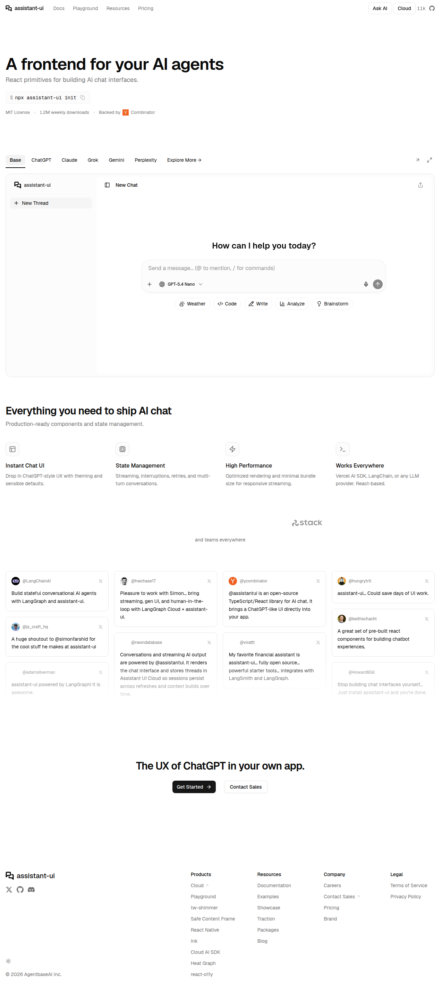
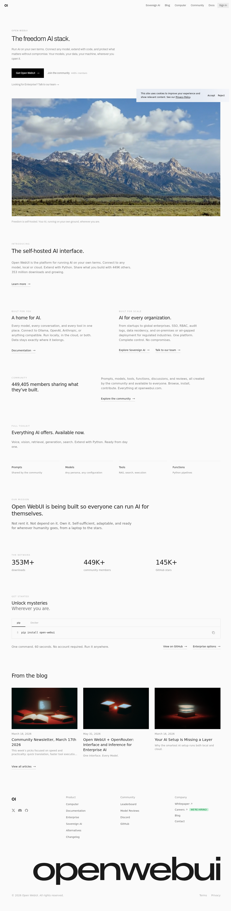
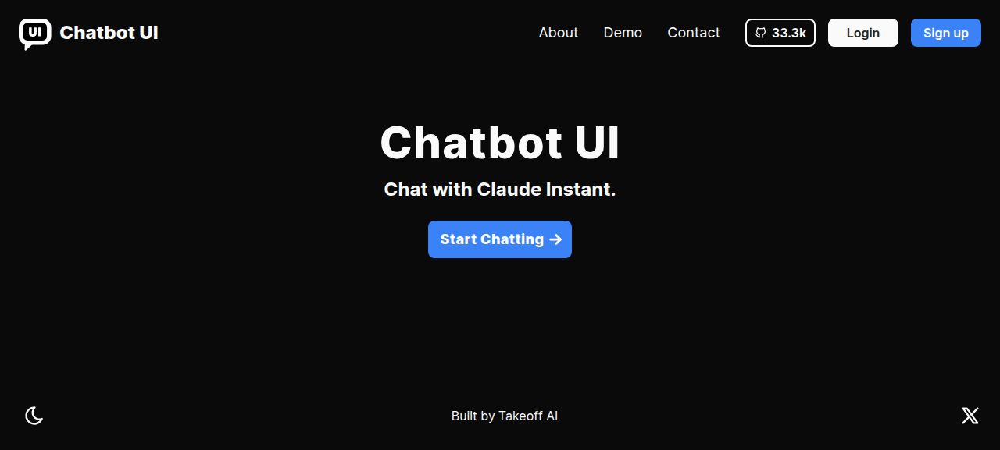
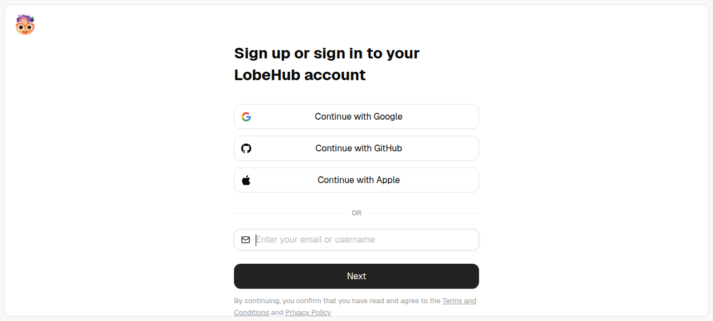
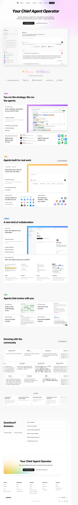
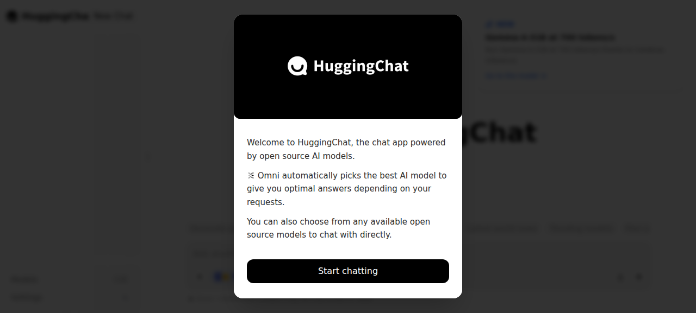

# AI Chat UI Reference Screenshots

Visual references from professional AI chat applications for Papo frontend design inspiration.

## Projects Compared

### 1. Assistant UI
- **URL**: https://www.assistant-ui.com
- **GitHub Stars**: ~11,000 ⭐
- **Screenshot**: 
- **Key Visual Features**:
  - Clean ChatGPT-style layout with collapsible sidebar
  - Quick action buttons (Weather, Code, Write, Analyze, Brainstorm)
  - Model selector dropdown in input bar
  - Voice input button alongside text input
  - Dark/light theme support
  - Multiple UI presets (ChatGPT, Claude, Grok, Gemini, Perplexity styles)
- **What Papo Can Borrow**:
  - Quick action suggestion buttons for common tasks
  - Model selector integrated into the input bar
  - Clean sidebar with thread management
  - Multiple visual theme presets

---

### 2. Open WebUI
- **URL**: https://openwebui.com
- **GitHub Stars**: ~144,600 ⭐ (most popular!)
- **Screenshot**: 
- **Key Visual Features**:
  - Self-hosted, privacy-first design philosophy
  - 449K+ community members with shared prompts/models/tools
  - Clean marketing page with mountain landscape hero
  - Enterprise features: SSO, RBAC, audit logs
  - Simple one-command install (pip/docker)
- **What Papo Can Borrow**:
  - Community-driven prompt/model sharing concept
  - Clean, professional marketing page design
  - Privacy-first messaging and positioning
  - Simple onboarding flow

---

### 3. Chatbot UI
- **URL**: https://chatbotui.com
- **GitHub Stars**: ~33,300 ⭐
- **Screenshot**: 
- **Key Visual Features**:
  - Minimalist dark-themed landing page
  - Simple "Start Chatting" CTA
  - 33.3k community stars displayed
  - Theme toggle (dark/light mode)
  - Clean, focused design without distractions
- **What Papo Can Borrow**:
  - Minimalist landing page approach
  - Prominent community/social proof display
  - Simple theme toggle in footer
  - Focused single-purpose design

---

### 4. LobeChat (LobeHub)
- **URL**: https://lobechat.com → https://lobehub.com
- **GitHub Stars**: ~79,600 ⭐
- **Screenshot**:  (sign-in page),  (marketing page)
- **Key Visual Features**:
  - "Your Chief Agent Operator" positioning
  - Multi-agent orchestration UI
  - Agent marketplace with 332K+ skills
  - 75K+ MCP servers integration
  - Professional marketing with video demos
  - Trusted by Google, AWS, DeepSeek, ByteDance
- **What Papo Can Borrow**:
  - Agent marketplace concept for Papo skills
  - Multi-agent collaboration UI patterns
  - Professional enterprise positioning
  - Integration ecosystem showcase

---

### 5. HuggingFace Chat UI
- **URL**: https://huggingface.co/chat
- **GitHub Stars**: ~10,800 ⭐
- **Screenshot**: 
- **Key Visual Features**:
  - Open-source AI model showcase
  - "Omni" auto-model selection feature
  - Welcome onboarding modal
  - Clean, simple interface
  - Model variety from open-source community
- **What Papo Can Borrow**:
  - Onboarding modal for first-time users
  - Auto-model selection concept
  - Open-source model integration approach
  - Simple, accessible design

---

## Summary Comparison

| Project | Stars | Strength | Best For Papo |
|---------|-------|----------|---------------|
| Open WebUI | 144K | Self-hosted, community | Privacy messaging, community features |
| LobeChat | 80K | Multi-agent, enterprise | Agent marketplace, integrations |
| Chatbot UI | 33K | Minimalist, focused | Clean design, simplicity |
| Assistant UI | 11K | React components | Quick actions, theme presets |
| HF Chat | 11K | Open-source models | Onboarding, model selection |

## Recommendations for Papo

1. **Quick Action Buttons**: Like Assistant UI, add suggestion buttons for common tasks
2. **Theme Support**: Implement dark/light mode toggle (Chatbot UI, Assistant UI)
3. **Onboarding Flow**: Welcome modal like HuggingChat for first-time users
4. **Community Features**: Consider prompt/skill sharing like Open WebUI
5. **Clean Input Bar**: Model selector + voice input + attachments (Assistant UI style)
